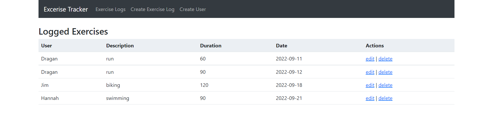
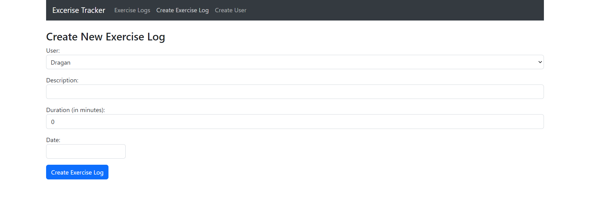
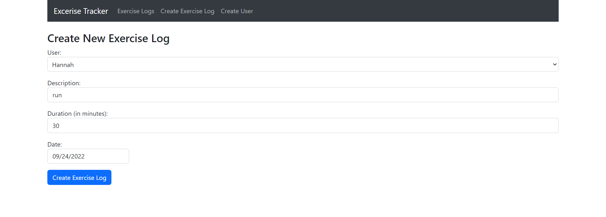

 <h1 align="center">Exercise Tracker</h1>

  

## About The Project

This is a web application that functions as an exercise log tracker. It was created using Java, Spring Boot, React, and MySQL.

 

## Usage
The basic functionality of the application is as follows:

* The program is launched and the Exercise Tracker webpage appears.

* This brings up the Exercise Logs page of the application, which displays all of the logged exercises. It can also be accessed at any time by clicking "Exercise Logs" in the navbar on the top of the page. From here, a user can either edit or delete an exercise log. Clicking the edit button brings the user to a page where they can edit the exercise log. Clicking the delete button will delete the exercise log from the list. The user can also access this page, the Create Exercise Log page and the Create User page from the navbar displayed on each page.

* Clicking Create User in the navbar on the top of a page will bring the user to the Create User page, where they can create a new user to be entered in the User section of an exercise log.

* Clicking Create Exercise Log on the navbar on the top of a page will bring the user to the Create Exercise Log page, where they can create a new exercise log.

* Clicking the edit link on any of the rows in the Exercise Logs page will bring the user to the Edit Exercise Log page, where the user can edit any of the aspects of the selected exercise log. Clicking the Edit Exercise Log button will update the respective exercise log in the Logged Exercises list on the Exercise Logs page of the application.

* Clicking the delete link on any of the rows in the Exercise Logs page will delete the respective exercise and refresh the page.

## File Structure

For the backend, the JPARepository extension in Spring Boot was used. The project uses JPARepository SQL calls, as well as HTTP calls via Request Mapping tags,  and the use of Entity tags for generating data objects to make calls to and from the MySQL database. It's made up of the following files in the java folder within src:

* ExerciseLog.java contains the data object file related to its respective table in the database
* ExerciseLogModel.java makes the SQL Repository calls to the database
* ExerciseLogController.java makes the HTTP requests calls via Model object calls
* ExerciseLogRepository.java is the interface file used for conencting to JPARepository
* User.java contains the data object file related to its respective table in the database
* UserModel.java makes the SQL Repository calls to the database
* UserController.java makes the HTTP requests calls via Model object calls
* UserRepository.java is the interface file used for conencting to JPARepository

In MySQL database called exercise_tracker_database is used, with exercise_log and user tables.
* The users table is a table that holds entries that contain the columns <i>user_id</i>, and <i>user</i>, these columns are referencing "User" entries from the respective Java file. 
* The exercises table is a table that holds exercise log entries that contain the columns <i>exercise_id</i>, <i>user</i>, <i>description</i>, <i>duration</i>, and <i>date</i>, these columns are referencing "Exercise Log" entries from the respective Java file.

For the frontend, React (combined with React Hooks and Bootstrap) were used for the client-side JavaScript framework. It's made up of the following files in the frontend folder within src:
* Index.js is the main page of the program, it renders the contents of the App.js file
* App.js combines all of the component files from the component folder.
* header.component.js located in the components folder contains the navbar that is shown at the top of each page. It provides links to the other pages of the website
* exercise-list.component.js located in the components folder displays all of the exercises. 
* create-user.component.js located in the components folder contains the page where a user can create a new user
* create-exercise.component.js located in the components folder contains the page where a user can create a new exercise log in the list of logged exercises
* edit-exercise.component.js located in the components folder contains the page that is displayed when a user selects the option to edit an exercise log
* component.css located in the components folder contains the additional css formatting that was used for the respective web pages that reference it
